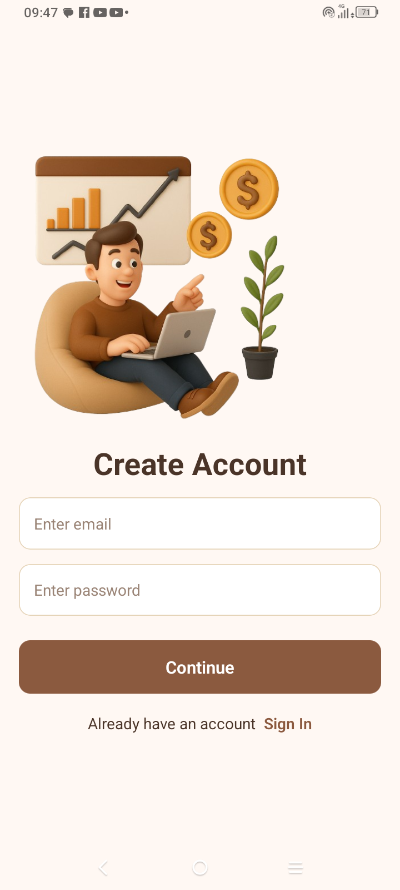

# 💰 Finance Tracker - React Native

A cross-platform mobile finance tracking app built with **React Native** and **Expo**, featuring modern authentication, rate limiting, and cloud-native PostgreSQL.

## 📱 Screenshots

| Sign Up Screen  | Login Screen |
|:--------------:|:------------:|
|  |  | 

| Home page | Add Transaction |
|:--------------:|:------------:|
|  |  |

| Logout alert | Delete transaction alert |
|:------------:|:--------------:|
|  |  |

## 🚀 Features

* 🔐 **Authentication**: Secure login & signup via Clerk.dev with email/password
* 📊 **Dashboard**: Clean overview showing total balance, income vs expenses
* 💰 **Transaction Management**: Add, categorize, and track income/expenses
* 🏷️ **Categories**: Pre-defined categories (Food & Drinks, Shopping, Transportation, Entertainment, Bills, Income, Other)
* 📋 **Transaction History**: Recent transactions with timestamps and delete functionality
* ⚡ **Real-time Updates**: Live balance calculations (LKR currency support)
* 🚪 **Secure Logout**: Confirmation modal for safe session management
* ⏳ **Rate Limiting**: API protection using Upstash Ratelimit
* ⚡ **Cloud DB**: Uses Neon for PostgreSQL storage
* 📱 **Cross-Platform**: Fully compatible with Android & iOS

## 🧰 Tech Stack

| Layer | Tech Used |
|-------|-----------|
| Frontend | React Native, Expo |
| Backend APIs | RESTful Node.js/Express |
| Auth | Clerk.dev |
| DB | Neon PostgreSQL |
| Rate Limiting | Upstash Ratelimit |
| Deployment | Railway Node.js backend |

## 💡 Key Features Shown in Screenshots

- **Dashboard**: Displays total balance (LKR 3150.00), income (LKR 5000.00), and expenses (LKR 1850.00)
- **Transaction Categories**: Food & Drinks, Shopping, Transportation, Entertainment, Bills, Income, Other
- **Recent Activity**: Shows transaction history with dates, amounts, and category icons
- **User Experience**: Clean UI with personalized welcome message and easy navigation
- **Security**: Logout confirmation modal and secure authentication flow

## 📥 Installation

### 📷 Scan QR Code

<pre align="center">
  ▄▄▄▄▄▄▄▄▄▄▄▄▄▄▄▄▄▄▄▄▄▄▄▄▄▄▄▄▄▄▄▄▄▄▄▄▄▄▄
  █ ▄▄▄▄▄ █▄▀ ▀ █▀█ █▀▄█ █ ▀█ █▄█ ▄▄▄▄▄ █
  █ █   █ █   █▀ ▄██▀ ▄██    ▀███ █   █ █
  █ █▄▄▄█ █▄█▀ ▄▀█▄▀█▄ ▀▄▀█ ▀ ▄▄█ █▄▄▄█ █
  █▄▄▄▄▄▄▄█▄█ █ █▄█ ▀▄█ █ ▀ █▄█▄█▄▄▄▄▄▄▄█
  █  ▄ ██▄▀ █ ▄ █▄██ ▀ ▀▄█ ██ █ ▄█▀▄  ▀▄█
  █▀▄▀█ ▀▄█▀ ▄▄▄▀█▀▄▄ █▄█    ▄█▄ ▀ ▄█  ▀█
  █ ▄ █▄ ▄██▄▀▀ ▄█ ▄ █▀██▄▄▄▄ ▀▀  ▀   █ █
  █▄▄▄ ██▄▀ ██ ██ █ ██▄▄▀▀▀ ▄ █▄▀█▀  █▄▀█
  █ ▄  ▄█▄▄▄ ██▄  ▀ █▀▄█ ▀   ▀▀▄█▀▀█▀▄ ▀█
  █▀██▄▀ ▄█▀▀ ▀█▄▄ █▀▄▀ █ ▀ ▄▀▄▄▄▀▀ ▀▄ ▄█
  █▀▀▀▄ ▀▄▄▀█▀███▀█  █ ▀ █▀▄█▄▄  █▀▄██ ██
  █▀ █ ▄▀▄▄ █ ▀▀▀▄█▄▄▀█▀▄▀ ▄▀ ▀█▀█▄▄ ▀███
  █▄██ ▀ ▄▀ ▄▄ ▄▄█▀█ █▀ █ █  ▀▀▀  ▀ █ ▄ █
  █▀▄▀▄▀ ▄██▄██▄▄▀▀▀█▄  ▀▀█▄█ █▀▄▄ ██▄▄▀█
  ██████▄▄█▀▄▄ ▄▄ ▀█▀█▄▄   ▀ ▀▄ ▄▄▄ ▄ ▄ █
  █ ▄▄▄▄▄ ██▀▀▀▀█▀▄█▀▀▀ ▄▀█▄█▀█ █▄█  █  █
  █ █   █ █▀▀█▀ █▄▄█▄█  ▄█ ██ █   ▄ █▀███
  █ █▄▄▄█ █ ██▄█  █▄▄▄▀ █    ▄▀█▀▄  ▄ ███
  █▄▄▄▄▄▄▄█▄▄▄▄█▄█▄█▄████▄▄▄▄▄███▄▄▄▄▄▄▄█
</pre>

### 🔗 Build Link

You can either click or copy the link below to download the Expo build:
Paste or click this link to open the build:

🔗 **Expo Build Link** 

[https://expo.dev/accounts/nirmalperera/projects/mobile/builds/7c9baa78-a09e-4e8e-b674-a1d77018c855](https://expo.dev/accounts/nirmalperera/projects/mobile/builds/7c9baa78-a09e-4e8e-b674-a1d77018c855)
